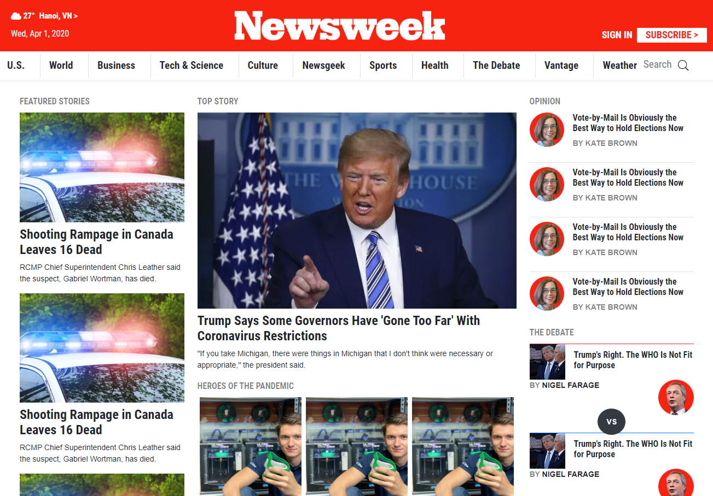

# Bootstrap Solo Project

> In this project I've cloned a website that was not made with Bootstrap.

I have been trying to use Bootstrap 4 as much as I could and minimize the use of CSS. I had to be creative in some situations with the combination of Bootstrap classes.

## Built With

- HTML5
- Bootstrap 4
- CSS3

## Live Demo

[Live Demo Link](https://raw.githack.com/Daniduran-dev/newsweek/feature/index.html)

## Authors

👤 **Daniel Duran**

- Github: [@Daniduran-dev](https://github.com/Daniduran-dev)

## 🤝 Contributing

Contributions, issues and feature requests are welcome!

Feel free to check the [issues page](issues/).

## Show your support

Give a ⭐️ if you like this project!

## Acknowledgments

- Microverse
- W3Schools
- Bootstrap
- Newsweek

## 📝 License

This project is [MIT](lic.url) licensed.
